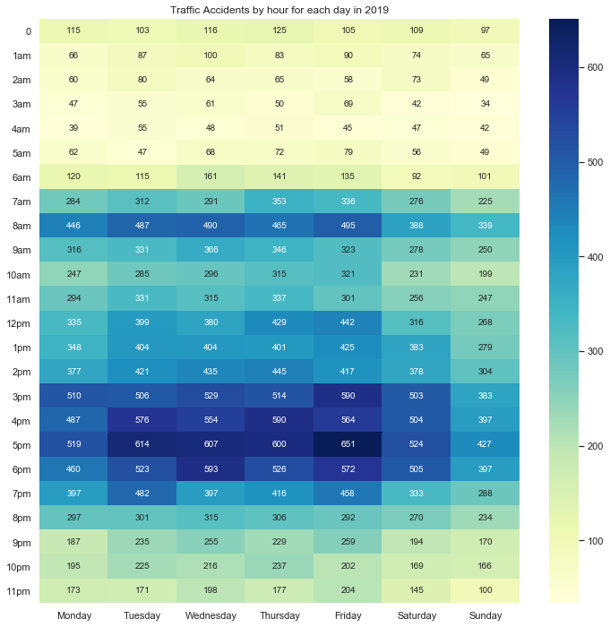

# CEASE Alert Notification

CEASE Alert Notification aims to leverage on smart infrastructures to allow SCDF to deploy help immediately to accident sites with little to no time delay. We hope to leverage a network of smart infrastructure to respond to emergency timely, saving lifes. Additionally, we would like to take precautionary measures by analysing available dataset to narrow down frequent timing of accidents happening. This valuable information can be used to better allocate manpower, ensuring the availability of resources when needed.

## Accident detection system through live CCTV footage

Using IBM Watson's visual recognition software, we can analyse still images from the CCTV footage to detect for traffic. If true, the image will then be analysed to see if an accident has occurred. This information can then be relayed to SCDF Ops Center to allow for faster deployment of emergency medical services.

## Data Analysis of Details of Past Accidents

Using Machine Learning and Data Analysis, we can create heatmap to show concentration of accidents happening throughout the day, throughout the month, as well as throughout the year. This may allow SCDF to better roster their shift works and even helps with the allocation of leaves throughout the year.

### Future Implementation

For future implementation, we may include locations of accidents. By adding more variables, it can further narrow down the scope. Additionally, we may connect it to live NEA information, such as the weather, and GPS application of drivers, to alert them when they are driving in accident-favourable situations, for them to drive even more cautiously. 

## Conclusion

We are proposing a two-pronged approach to tackle any possible unreported traffic accident which ended up costing lives. On top of that, we would like to use technology to our advantage in terms of planning. In the long run, we would like to take precautionary measures to help minimise the occurrence of accidents by alerting drivers in advance.

## Results
## Using Custom IBM Classifier to identify Cars
By keying in url of an image, we are able to generate the probability of it being an empty road or the presence of cars on the road.

# INSERT 1,2,3 (NO CAR, CAR, ACCIDENT) THANKS

    

### Data Analysis of Details of Past Accidents

From the heatmap above, there is an obvious concentration of accidents during January. It could be the result of the festive season where there is a lot of alcohol consumption.

    

From the heatmap above, there is an obvious concentration of accidents during the peak hour during 8am and between 4pm to 6pm. Furthermore the most accident rate happens on a Friday and it could be because workers were rushing home from work.
