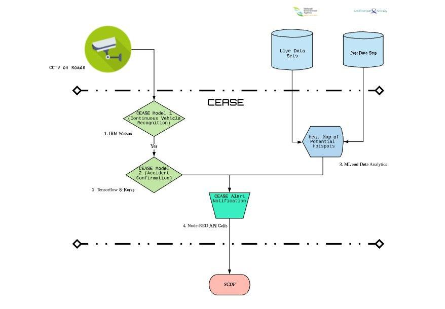

# Emcoder-CEASE_SCDFXIBM
**A rag-tag bunch of misfits brought together by the desire to make a difference with some ideas and code**

This project uses Artificial Intelligence and Machine Learning to improve allocation of resources and access to prehospital care for those in need.

Submitted to SCDF X IBM - Lifesavers' Innovation Challenge: Call For Code 2020.

Team members: Jaxsen Chew, Wong Ying, Hussain Khozema, Veric Tan, Jeremy Book

<insert image, maybe a sample image with the image recognition values at the side>

## Contents

1. [The problem](#the-problem)
1. [Our Pitch](#our-pitch)
1. [The Architecture](#the-architecture)
1. [Long Description](#long-description)
1. [Installation and Setup Guide](#installation-and-setup-guide)
1. [Running Tests](#running-tests)
1. [Libraries Used](#libraries-used)

## The problem

Every day, dedicated officers of the Singapore Civil Defence Force work tirelessly to mitigate and respond to emergencies that spring up across the island. In 2019, about 10,400 emergency calls were directly related to road traffic accidents, averaging 29 calls a day for that year. Despite the 3.3% drop in fatalities on the road, incidents such as speeding, red-light running, and accidents involving elderly pedestrians and motorcyclists increase the risk of accidents and injury. Between 2018 and 2019, these incidents have been on the rise. 

Singapore has made significant strides in ensuring our roads are safe even by international standards. However, the fact remains that each emergency call made for non-fatal road accidents draws precious emergency resources away from responding to calls for trauma emergencies especially with our ageing population. If we are able to hit null on the cases of road accidents, that will free up manpower and other resources in the SCDF for our future.

### The idea

In response to the backdrop described, Team Emcoder, has created and conceptualise a system called CEASE (Comprehensive Early Action Sensing for Emergency). It is a system for SCDF to target early intervention measures in a two-pronged approach. Each prong aims to optimize the use of SCDF’s resources. 
1. Comprehensive Hotspot Prediction
1. Continuous Accident Monitoring

Our system leverages sensors and data that has already been installed or collected along all of Singapore’s roads, such as the Land Transport Authority's API for live traffic conditions[1](https://www.mytransport.sg/content/mytransport/home/dataMall/dynamic-data.html).
We are proposing a system to decide when and where early intervention measures can be placed that will be the most efficient use of our precious emergency resources. Although we are not preaching a method to bring road accidents down to 0, we see this as an optimization problem to target and concentrate SCDF’s resources to make the greatest impact.

### How can technology help?

By using live data of road conditions and CCTV footage, we can create a live heatmap of potential hotspots for accidents and automatically detect accidents with a high degree of certainty. These information will be sent to SCDF through our CEASE alert notification, allowing for better allocation of resources and quicker access to prehospital care for those in need.

    

## Our Pitch

< pitch video >
  
## The Architecture

    

1. IBM Watsons detects vehicles through still images from video footage from live CCTVs.
2. Tensorflow and Keras detect accidents within the frame if it was validated as a vehicle previously.
3. Machine Learning and Data Analytics use past dataset of accidents to generate a heat map, indicating when accidents tend to happen.
4. Important information is sent to SCDF using Node-RED API Calls.
  
## Long Description

[More details are available here](DESCRIPTION.md)

## Installation and Setup Guide

### Installing Python 3.6

- Install Python from the [official website](https://www.python.org/downloads/).
- During the installation, ensure that you check the box for installing pip alongside Python 3.6.
- Ensure Python 3.6 has been added to your path by opening a new terminal and entering python `--version`. This should report your Python version as 3.6.x.
- Run the following command in your terminal: `pip install --upgrade pip`
- Verify `pip` install by typing: `pip --version`

### Installing IBM Watson and IBM Cloud

pip install `--upgrade "ibm-watson>=4.0.1"`

### Installing other dependencies

- `pip install numpy`
- `pip install pandas`
- `pip install tensorflow`
- `pip install matplotlib`
- `pip install seaborn`
  
### Installing Jupyter

You can find the installation documentation for the [Jupyter platform](https://jupyter.readthedocs.io/en/latest/install.html), on ReadTheDocs.

## Running tests
< Explanation and breakdown on how to run tests for the proposed solution >

## Libraries Used

* [IBM Watson](https://www.ibm.com/sg-en/watson)
* IBM Cloud SDK Core Authenticators
* [Numpy](https://github.com/numpy/numpy)
* [Pandas](https://github.com/pandas-dev/pandas)
* [Matplotlib](https://github.com/matplotlib/matplotlib)
* [Seaborn](https://github.com/seaborn/seaborn)
* [Tensorflow](https://github.com/tensorflow/tensorflow)
* [Keras RetinaNet](https://github.com/fizyr/keras-retinanet/blob/master/README.md)
